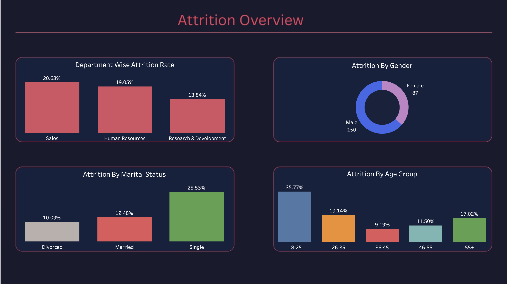
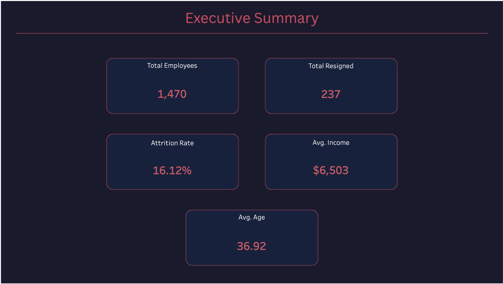
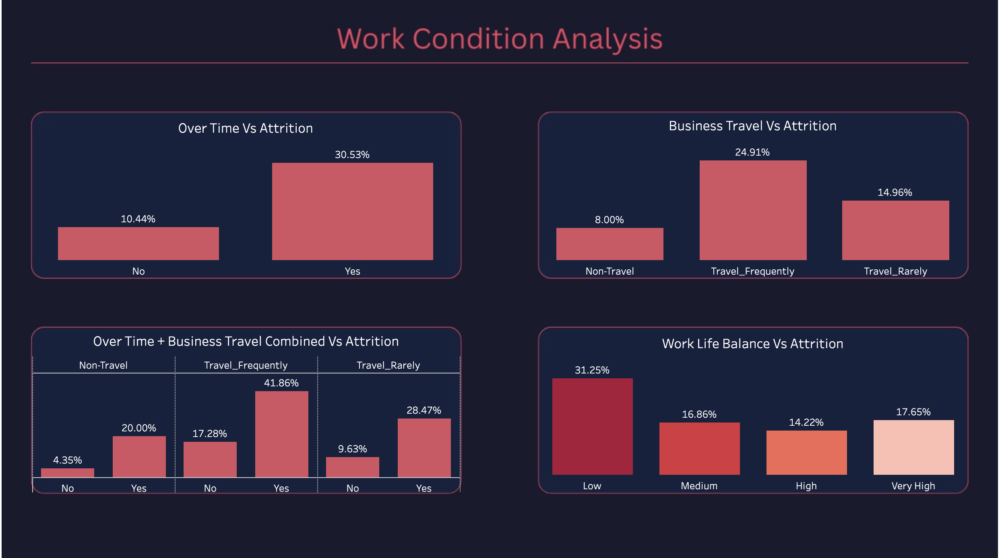
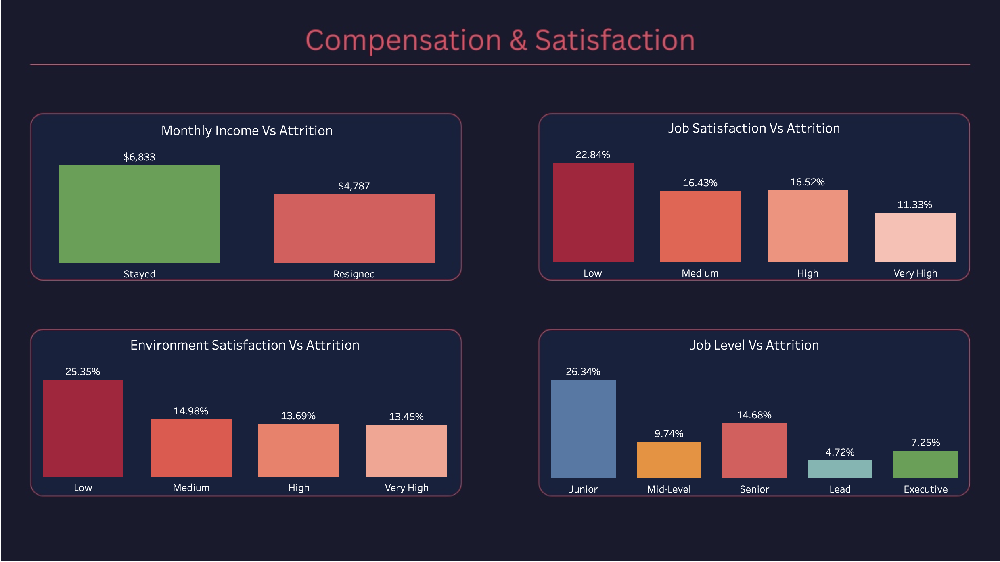

# 👥 IBM HR Employee Attrition Analysis

An end-to-end Data Analytics project covering data cleaning, exploratory data analysis, and interactive dashboard development on the IBM HR Analytics dataset.



---

## 📌 Project Overview

This project analyzes **1,470 employee records** from IBM HR data to identify the key drivers of employee attrition and provide actionable recommendations to reduce turnover.

| Detail | Info |
|---|---|
| Dataset | [IBM HR Analytics Dataset (Kaggle)](https://www.kaggle.com/datasets/pavansubhasht/ibm-hr-analytics-attrition-dataset) |
| Records | 1,470 employees |
| Features | 32 columns |
| Attrition Rate | 16.1% |

---

## 🛠️ Tools & Technologies

| Tool | Purpose |
|---|---|
| Python (Pandas, Seaborn, Matplotlib) | Data cleaning, EDA & Visualization |
| Tableau Public | Dashboard & Story development |
| Canva | Dashboard UI design |
| Microsoft Word | Formal report |

---

## 🧹 Data Cleaning Process

All cleaning was performed in **Python (Jupyter Notebook)**.

| Step | Action | Result |
|---|---|---|
| Column Removal | Dropped EmployeeCount, Over18, StandardHours | Redundant columns removed |
| Data Type Conversion | Attrition & OverTime → 0/1 | Numeric for analysis |
| Categorical Conversion | Satisfaction & Rating columns → category type | Memory optimized |
| Label Mapping | Performance Rating, Job Satisfaction → Low/Medium/High/Very High | Human readable |

---

## 📊 Key Findings & Insights

### 🔴 Attrition Overview
- **Overall Attrition Rate:** 16.1% — above industry average
- **Sales Department** has the highest attrition rate **(20.6%)**
- **R&D Department** has the lowest attrition rate **(13.8%)**

### ⏰ Work Condition Analysis
- Employees working **overtime resign 3x more** (30.5% vs 10.4%)
- **Frequent travelers** have nearly 3x higher attrition than non-travelers (24.9% vs 8.0%)
- **Overtime + Frequent Travel combined** leads to **41.86% attrition** — 10x higher than neither (4.35%)

### 👤 Employee Demographics
- **Single employees** have the highest attrition rate **(25.53%)**
- **Young employees (18-25)** are most at risk with **35% attrition**
- Attrition decreases significantly after age 35

### 💰 Compensation Analysis
- Resigned employees earned **30% less** than those who stayed ($4,787 vs $6,833)
- **Junior level employees** have the highest attrition at **26.34%**
- Low job satisfaction doubles the attrition rate (22.83% vs 11.33%)

---

## 📋 Interactive Dashboard

### Story 1 — Overview: 16.1% of Employees Have Left the Organization


### Story 2 — Who Is Leaving? Young, Single & Junior Employees


### Story 3 — Why Are They Leaving? Overtime & Travel Drive Attrition


### Story 4 — Compensation Gap: Resigned Employees Earned 30% Less


🔗 **[View Live Dashboard on Tableau Public](https://public.tableau.com/app/profile/mehedi.hasan2176/viz/IBMHREmployeeAttritionAnalysis_17773704631440/Story1)**

---

## 💡 Business Recommendations

1. **Overtime Policy** — Make overtime voluntary and provide additional compensation to reduce burnout
2. **Business Travel** — Reduce unnecessary travel by utilizing virtual meetings where possible
3. **Junior Compensation** — Increase salary for entry-level employees to improve retention
4. **Young Employees** — Provide clear career growth paths, mentorship programs, and performance-based bonuses
5. **Sales Department** — Introduce stable base salaries alongside commission to reduce income instability
6. **Job Satisfaction** — Conduct regular employee feedback sessions to identify and address dissatisfaction early

---

## 📂 Project Structure

```
ibm-hr-attrition-analysis/
├── images/
│   ├── dashboard_overview.png
│   ├── dashboard_1.png
│   ├── dashboard_2.png
│   ├── dashboard_3.png
│   └── dashboard_4.png
├── notebook/
│   └── ibm_hr_attrition_analysis.ipynb
├── report/
│   └── IBM_HR_Employee_Attrition_Analysis.pdf
└── README.md
```

---

## 👤 Author

**Mehedi Hasan**

[](https://www.linkedin.com/in/mehedi-hasan-094855388/)
[](https://github.com/mehedi-hasan00)
[](https://public.tableau.com/app/profile/mehedi.hasan2176)
[](https://www.kaggle.com/mehedi71)
